# Gallery

| Image | Description | Notebook |
| :---: | :--- | :---: |
| 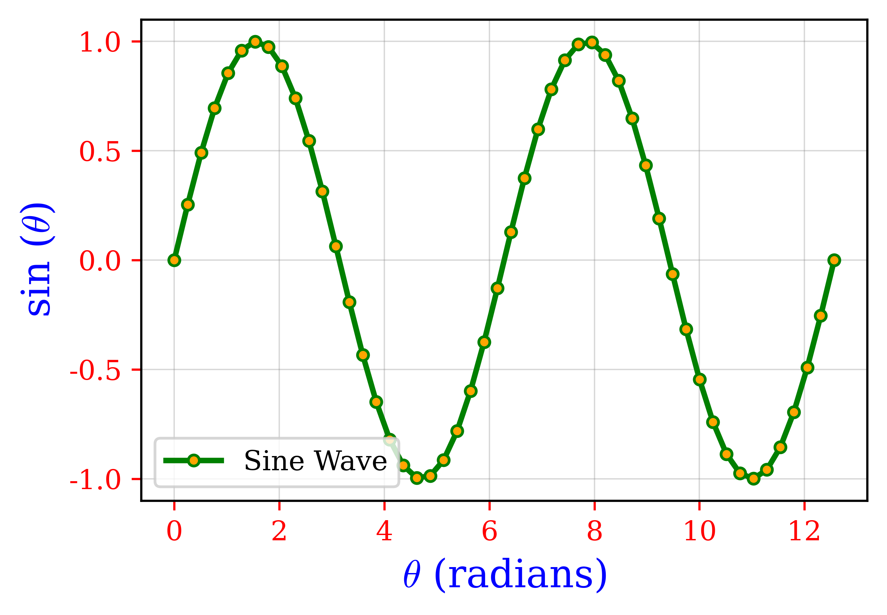 | **line example sine wave** | [See script](https://github.com/Pesquisa-UFCAT/plot_gallery/blob/main/charts-line/one_line_0.ipynb) |
| 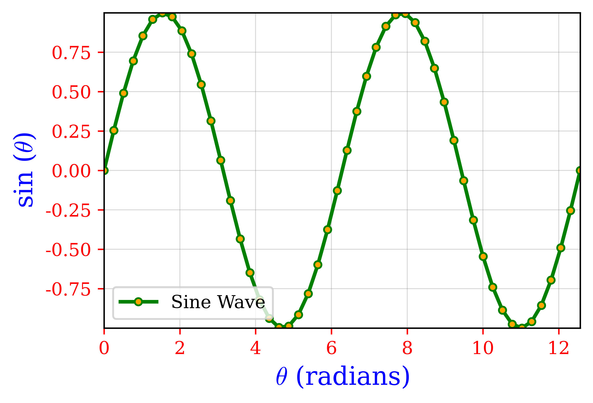 | **line example axis limit sine wave** | [See script](https://github.com/Pesquisa-UFCAT/plot_gallery/blob/main/charts-line/one_line_1.ipynb) |
| 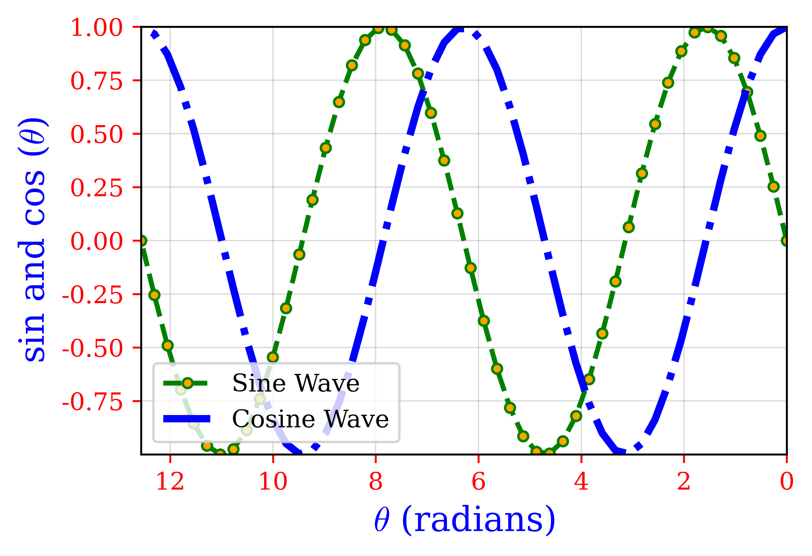 | **line example axis limit invert axis sine  cosine wave** | [See script](https://github.com/Pesquisa-UFCAT/plot_gallery/blob/main/charts-line/one_line_2.ipynb) |
| 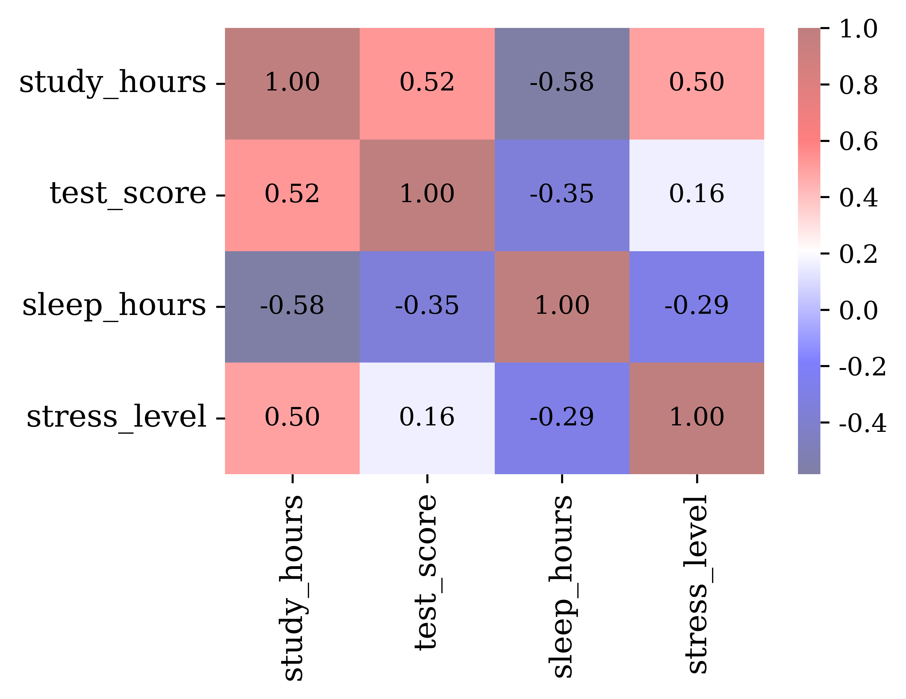 | **correlation heatmap using correlation info** | [See script](https://github.com/Pesquisa-UFCAT/plot_gallery/blob/main/charts-heatmap/heatmap_0.ipynb) |
| 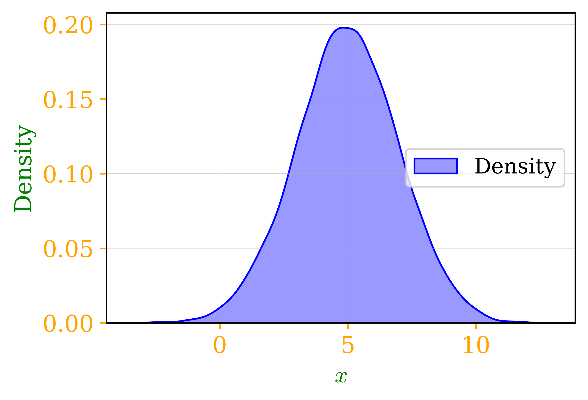 | **kde histogram one variable** | [See script](https://github.com/Pesquisa-UFCAT/plot_gallery/blob/main/charts-histogram/kde_histogram_0.ipynb) |
| 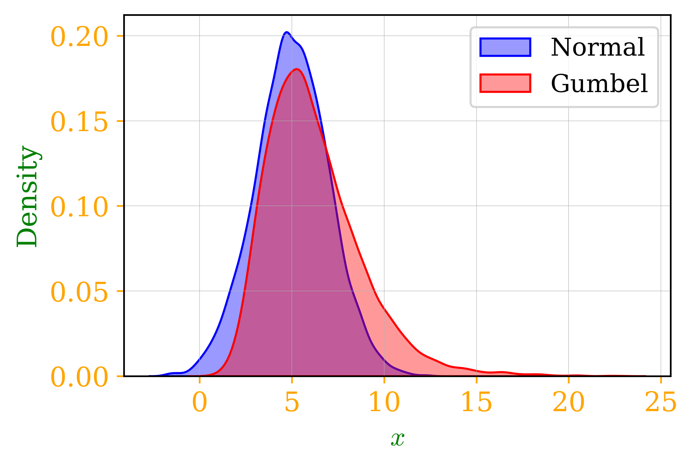 | **kde histogram compare** | [See script](https://github.com/Pesquisa-UFCAT/plot_gallery/blob/main/charts-histogram/kde_histogram_1.ipynb) |
| 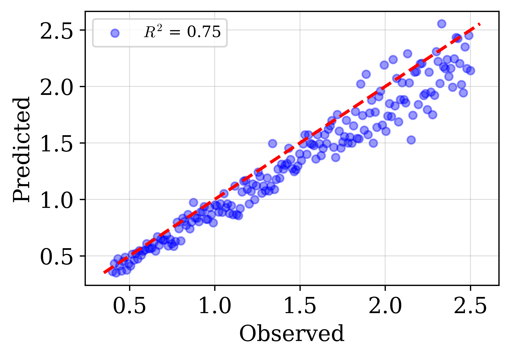 | **mix predicted vs observed** | [See script](https://github.com/Pesquisa-UFCAT/plot_gallery/blob/main/charts-mix/mix_scatter_line_0.ipynb) |
| 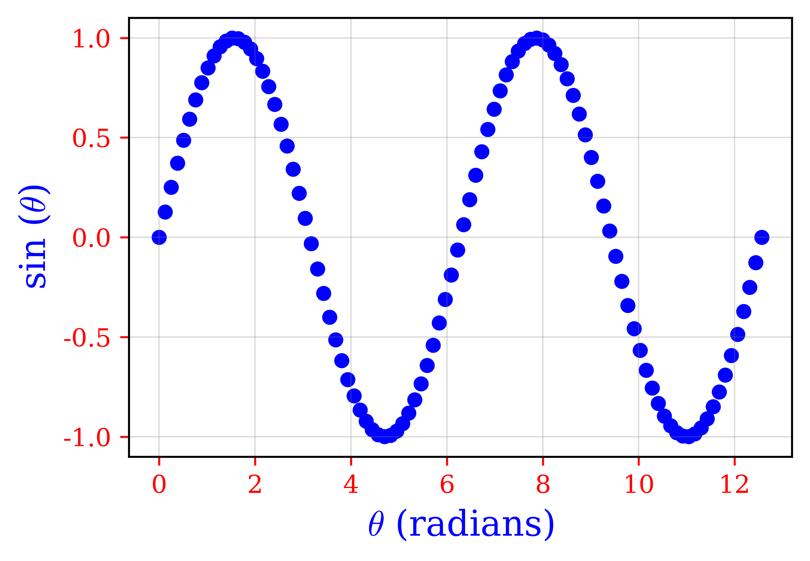 | **scatter example sine scatter** | [See script](https://github.com/Pesquisa-UFCAT/plot_gallery/blob/main/charts-scatter/scatter_0.ipynb) |
| 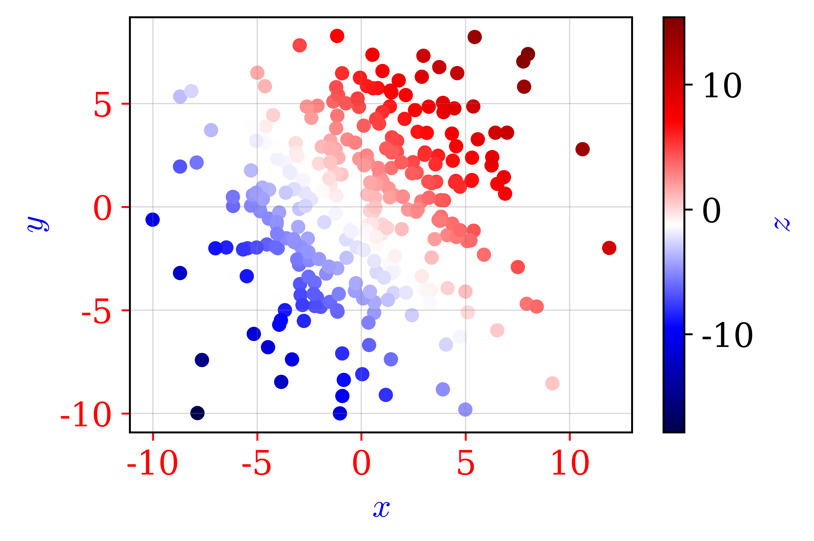 | **scatter example sine scatter with cmap** | [See script](https://github.com/Pesquisa-UFCAT/plot_gallery/blob/main/charts-scatter/scatter_1.ipynb) |
| 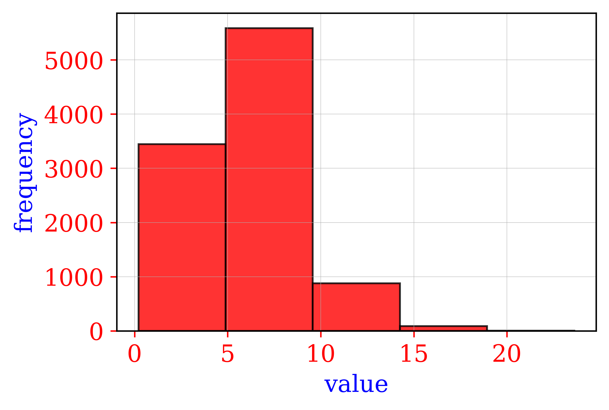 | **bar histogram** | [See script](https://github.com/Pesquisa-UFCAT/plot_gallery/blob/main/charts-histogram/bar_histogram_0.ipynb) |
| 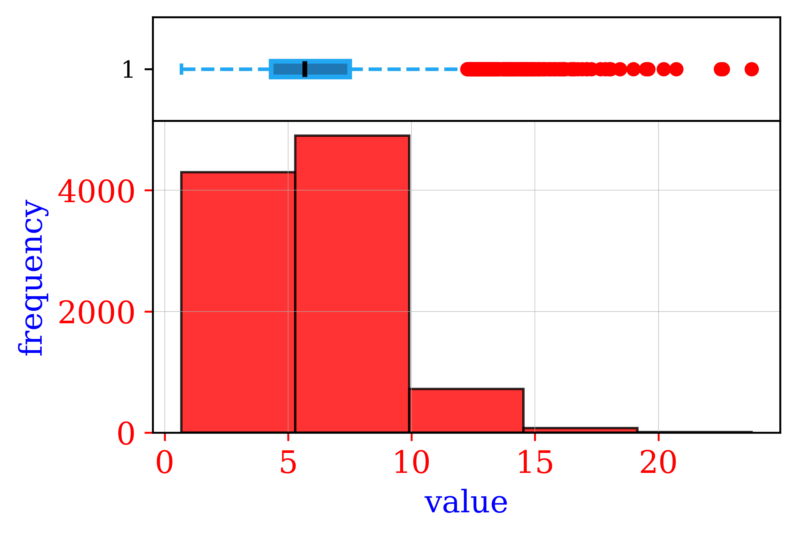 | **bar histogram with boxplot** | [See script](https://github.com/Pesquisa-UFCAT/plot_gallery/blob/main/charts-histogram/bar_histogram_1.ipynb) |
| 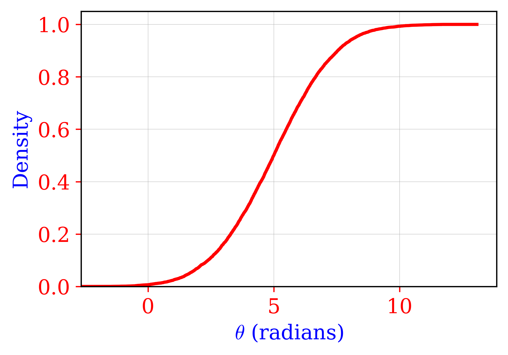 | **traditional cdf** | [See script](https://github.com/Pesquisa-UFCAT/plot_gallery/blob/main/charts-cdf/cdf_chart_0.ipynb) |
|  | **traditional cdf with kde** | [See script](https://github.com/Pesquisa-UFCAT/plot_gallery/blob/main/charts-cdf/cdf_with_kde_0.ipynb) |
